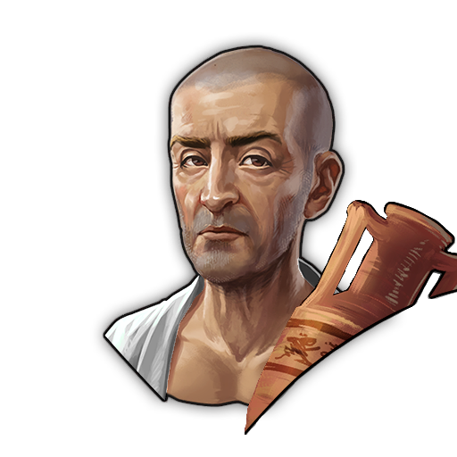
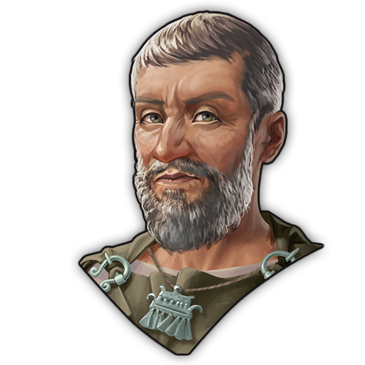
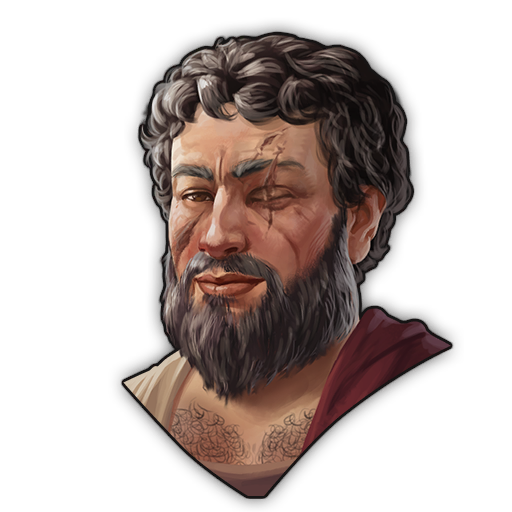
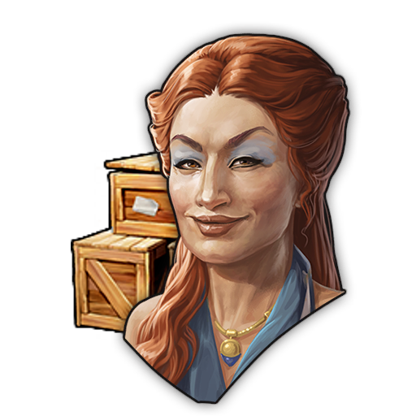
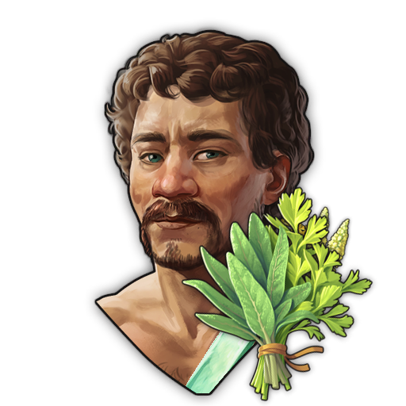
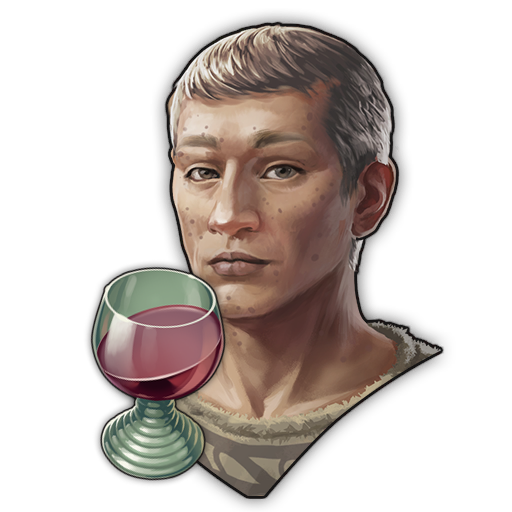
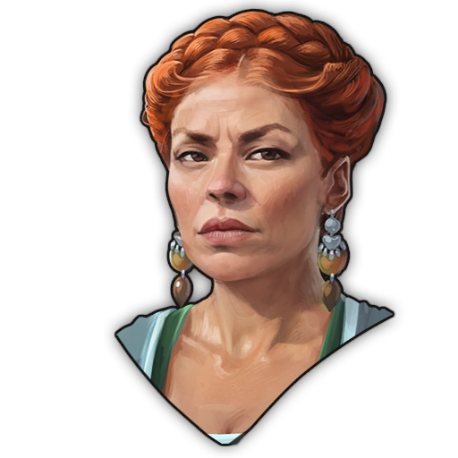

# Residence Workforce Specialist Pack - Mod
This mod adds Specialists with focus on gaining different types of Workforce into Anno 117. This Mod is part as a submod of "Extended Specialists Mod".
***

### Specialists Overview (AI Generated - might still contain Issues)
***

### Common Specialists
| Image Preview | GUID | Internal Name | Itemname | Description | Targets | Base Effects |
| :---: | :---: | :---: | :---: | :---: | :---: | :---: |
|  | 1600000317 | Specialist R02Resi-AddWF-R01-C | Promising Liberti | Worked hard for his success. (ResidenceWorkforce-Pack) | Plebeian Residences | **Building Buff:** • -3 Happiness • -3 Health • -3 Fire Safety **Additional Workforce:** Liberti |
***
### Rare Specialists
| Image Preview | GUID | Internal Name | Itemname | Description | Targets | Base Effects |
| :---: | :---: | :---: | :---: | :---: | :---: | :---: |
|  | 1600000190 | Specialist C03Resi-AddWF-C02-R | Retired Smith | The youth can always learn from the elder ones. (ResidenceWorkforce-Pack) | Alderman Residences | **Building Buff:** • -3 Happiness • -3 Health • -3 Fire Safety **Additional Workforce:** Smiths |
|  | 1600000210 | Specialist RC03Resi-AddWF-RC02-R | Grounded Nobleman | Not as aloof as other nobles. (ResidenceWorkforce-Pack) | Noble Residences | **Building Buff:** • -3 Happiness • -3 Health • -3 Fire Safety **Additional Workforce:** Mercantors |
|  | 1600000208 | Specialist R04Resi-AddWF-R03-R | Aspiring Equites | Rich, but not rich enough to be considered that relevant. (ResidenceWorkforce-Pack) | Patrician Residences | **Building Buff:** • -3 Happiness • -3 Health • -3 Fire Safety **Additional Workforce:** Equites |
|  | 1600000240 | Specialist RC02Resi-AddWF-C01-R | Merchant with Entourage | Has so much to trade, always in need a company of strong man around. (ResidenceWorkforce-Pack) | Mercator Residences | **Building Buff:** • -3 Happiness • -3 Health • -3 Fire Safety **Additional Workforce:** Waders |
|  | 1600000206 | Specialist R03Resi-AddWF-R02-R | Aspiring Plebeian | Thanks to her hard work, she is ready to move up to the next roman stratum. (ResidenceWorkforce-Pack) | Equites Residences | **Building Buff:** • -3 Happiness • -3 Health • -3 Fire Safety **Additional Workforce:** Plebeians |
|  | 1600000242 | Specialist C02Resi-AddWF-C01-R | Lovestruck Wader | Wants to bring flowers to his love, but only finds herbs. (ResidenceWorkforce-Pack) | Smith Residences | **Building Buff:** • -3 Happiness • -3 Health • -3 Fire Safety **Additional Workforce:** Waders |
***
### Epic Specialists
| Image Preview | GUID | Internal Name | Itemname | Description | Targets | Base Effects |
| :---: | :---: | :---: | :---: | :---: | :---: | :---: |
|  | 1600000126 | Specialist R04Resi-AddWF-R02-E | Cornelia Operosa, the Fascinated One | Always in need of a group of Liberti for her luxurious needs. (ResidenceWorkforce-Pack) | Patrician Residences | **Building Buff:** • -3 Happiness • -3 Health • -3 Fire Safety **Additional Workforce:** Plebeians |
|  | 1600000124 | Specialist R03Resi-AddWF-R01-E | Domitia Regilla, Always Accompanied | Always in need of a group of Liberti for her luxurious needs. (ResidenceWorkforce-Pack) | Equites Residences | **Building Buff:** • -3 Happiness • -3 Health • -3 Fire Safety **Additional Workforce:** Liberti |
***
### Legendary Specialists
| Image Preview | GUID | Internal Name | Itemname | Description | Targets | Base Effects | Boosted Effects | Boost Condition |
| :---: | :---: | :---: | :---: | :---: | :---: | :---: | :---: | :---: |
|  | 1600000156 | Specialist R04Resi-AddWF-R01-L | Marcus Pius, Fair and Thoughtful Patronus | Knows without a mass of Liberti, he would be nothing. (ResidenceWorkforce-Pack) | Patrician Residences | **Building Buff:** • -3 Happiness • -3 Health • -3 Fire Safety **Additional Workforce:** Liberti | **Building Buff:** • -4 Happiness • -4 Health • -4 Fire Safety **Additional Workforces:** Liberti, Plebeians, Equites | Now needs a large number of additional sponsors. (200x Patrician Residences on Island) |
|  | 1600000238 | Specialist RC03C03Resi-AddWF-C01-L | Lucia Domitius Catavignus, Romano-Celtic Envoy | "I enjoy the modesty of the Alder Council." (1x Alder Council on Island) | Noble Residences, Alderman Residences | **Building Buff:** • -3 Happiness • -3 Health • -3 Fire Safety **Additional Workforce:** Waders | **Building Buff:** • -4 Happiness • -4 Health • -4 Fire Safety **Additional Workforces:** Waders, Smiths, Mercantors | "I enjoy the modesty of the Alder Council." (1x Alder Council on Island) |
